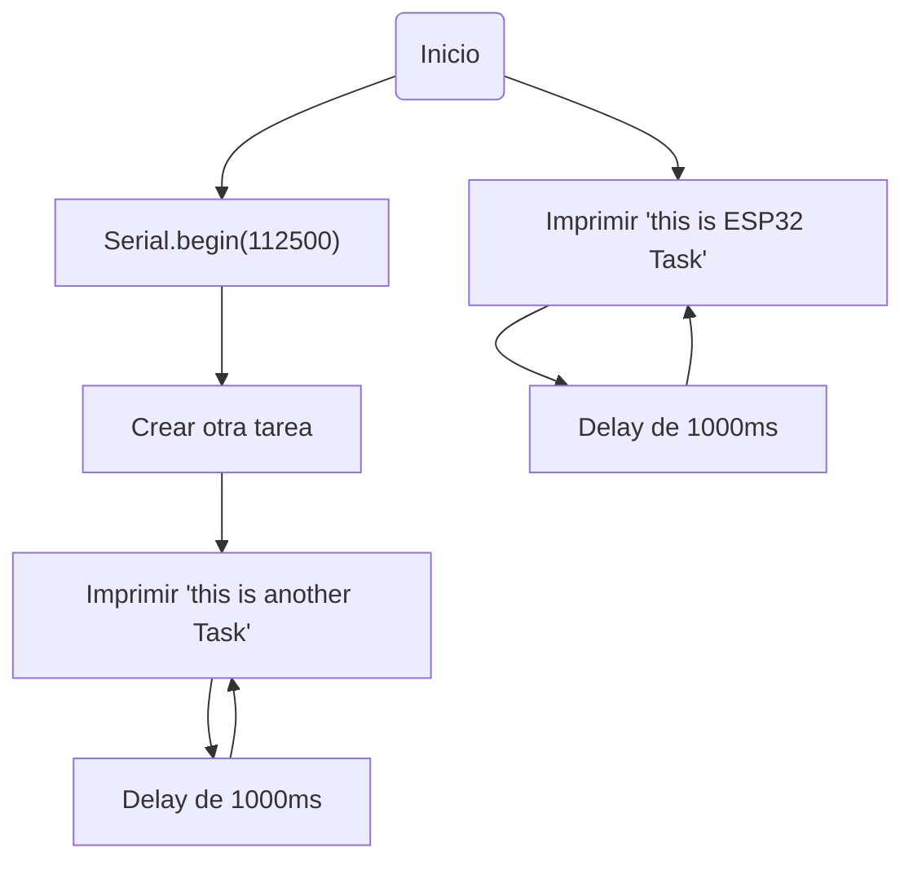

# PRACTICA-4
# Práctica 4: Sistemas Operativos en Tiempo Real

## Objetivo
El objetivo de esta práctica es comprender el funcionamiento de un sistema operativo en tiempo real (RTOS). Para ello, realizaremos ejercicios prácticos en los que crearemos y ejecutaremos múltiples tareas en un microcontrolador ESP32 utilizando FreeRTOS, observando cómo se distribuye el tiempo de la CPU entre ellas.

## Materiales
- ESP32-S3
- Arduino IDE

---

## Primera Parte: Creación de Tareas en FreeRTOS

### Código
```cpp
    #include <Arduino.h>

    void anotherTask( void * parameter );
    void setup()
    {
        Serial.begin(112500);
        /* we create a new task here */
        xTaskCreate(
        anotherTask, /* Task function. */
        "another Task", /* name of task. */
        10000, /* Stack size of task */
        NULL, /* parameter of the task */
        1, /* priority of the task */
        NULL); /* Task handle to keep track of created task */
    }
    /* the forever loop() function is invoked by Arduino ESP32 loopTask */
    void loop()
    {
        Serial.println("this is ESP32 Task");
        delay(1000);
    }
    /* this function will be invoked when additionalTask was created */
    void anotherTask( void * parameter )
    {
        /* loop forever */
        for(;;)
        {
            Serial.println("this is another Task");
            delay(1000);
        }
        /* delete a task when finish,
        this will never happen because this is infinity loop */
        vTaskDelete( NULL );
    }
```

### Descripción y Funcionamiento
El código implementa un sistema operativo en tiempo real donde se crean dos tareas concurrentes:

- **Tarea principal:** Se ejecuta en la función `loop()`, imprimiendo repetidamente "this is ESP32 Task" en el puerto serie cada segundo.
- **Tarea secundaria:** Creada en `setup()` mediante `xTaskCreate()`. Su función es imprimir "this is another Task" cada segundo en un bucle infinito.

Ambas tareas se ejecutan simultáneamente gracias a FreeRTOS, dividiendo el tiempo de CPU entre ellas.

### Salida esperada en el puerto serie:
```
this is another Task
this is ESP32 Task
this is another Task
this is ESP32 Task
```

### Diagrama de flujo


---

## Segunda Parte: Uso de Semáforos en FreeRTOS

### Código
```cpp
#include <Arduino.h>
#include <FreeRTOS.h>
#include <task.h>
#include <semphr.h>

const int ledPin = 11;
SemaphoreHandle_t semaphore;

void setup() {
    Serial.begin(115200);
    pinMode(ledPin, OUTPUT);
    semaphore = xSemaphoreCreateBinary();
    
    xTaskCreate(encenderLED, "Encender LED", 1000, NULL, 1, NULL);
    xTaskCreate(apagarLED, "Apagar LED", 1000, NULL, 1, NULL);
}

void loop() {
}

void encenderLED(void *parameter) {
    for (;;) {
        digitalWrite(ledPin, HIGH);
        Serial.println("LED HIGH");
        delay(1000);
        xSemaphoreGive(semaphore);
    }
}

void apagarLED(void *parameter) {
    for (;;) {
        digitalWrite(ledPin, LOW);
        Serial.println("LED LOW");
        delay(1000);
        xSemaphoreGive(semaphore);
    }
}
```

### Descripción y Funcionamiento
Este código utiliza un semáforo para alternar entre dos tareas:

- **Tarea encenderLED():** Enciende un LED, imprime "LED HIGH" y espera un segundo.
- **Tarea apagarLED():** Apaga el LED, imprime "LED LOW" y espera un segundo.

Las tareas se alternan cada segundo gracias al uso del semáforo.

### Salida esperada en el puerto serie:
```
LED HIGH
LED LOW
LED HIGH
LED LOW
```

---

## Conclusión
Esta práctica nos ha permitido experimentar con FreeRTOS y comprender cómo se pueden ejecutar múltiples tareas en un microcontrolador ESP32. En la primera parte, vimos cómo se pueden crear tareas concurrentes y, en la segunda, exploramos la sincronización entre ellas utilizando un semáforo. Esto demuestra el potencial de los sistemas operativos en tiempo real para gestionar la ejecución eficiente de procesos.

## **Ejercicios de mejora de nota**

### **Reloj:**
**Codigo:**
```cpp
#include <Arduino.h>
#include "freertos/FreeRTOS.h"
#include "freertos/task.h"
#include "freertos/queue.h"
#include "freertos/semphr.h"


// Definición de pines
#define LED_SEGUNDOS 2  
#define LED_MODO 40    
#define BTN_MODO 48    
#define BTN_INCREMENTO 36


// Variables globales del reloj
volatile int horas = 0, minutos = 0, segundos = 0;
volatile int modo = 0;  


// Recursos FreeRTOS
QueueHandle_t botonQueue;
SemaphoreHandle_t relojMutex;


// Estructura para eventos de botón
typedef struct {
    uint8_t boton;
    uint32_t tiempo;
} EventoBoton;


void IRAM_ATTR ISR_Boton(void *arg) {
    uint8_t numeroPulsador = (uint32_t)arg;
    EventoBoton evento = {numeroPulsador, xTaskGetTickCountFromISR()};
    xQueueSendFromISR(botonQueue, &evento, NULL);
}


void TareaReloj(void *pvParameters) {
    TickType_t xLastWakeTime = xTaskGetTickCount();
    const TickType_t xPeriod = pdMS_TO_TICKS(1000);
   
    for (;;) {
        vTaskDelayUntil(&xLastWakeTime, xPeriod);
        if (xSemaphoreTake(relojMutex, portMAX_DELAY)) {
            if (modo == 0) {
                segundos++;
                if (segundos == 60) {
                    segundos = 0;
                    minutos++;
                    if (minutos == 60) {
                        minutos = 0;
                        horas = (horas + 1) % 24;
                    }
                }
            }
            xSemaphoreGive(relojMutex);
        }
    }
}


void TareaLecturaBotones(void *pvParameters) {
    EventoBoton evento;
    for (;;) {
        if (xQueueReceive(botonQueue, &evento, portMAX_DELAY)) {
            if (xSemaphoreTake(relojMutex, portMAX_DELAY)) {
                if (evento.boton == BTN_MODO) {
                    modo = (modo + 1) % 3;
                } else if (evento.boton == BTN_INCREMENTO) {
                    if (modo == 1) horas = (horas + 1) % 24;
                    if (modo == 2) minutos = (minutos + 1) % 60;
                }
                xSemaphoreGive(relojMutex);
            }
        }
    }
}


void TareaActualizacionDisplay(void *pvParameters) {
    int last_h = -1, last_m = -1, last_s = -1, last_modo = -1;
    for (;;) {
        if (xSemaphoreTake(relojMutex, portMAX_DELAY)) {
            if (horas != last_h || minutos != last_m || segundos != last_s || modo != last_modo) {
                Serial.printf("Hora: %02d:%02d:%02d  | Modo: %d\n", horas, minutos, segundos, modo);
                last_h = horas; last_m = minutos; last_s = segundos; last_modo = modo;
            }
            xSemaphoreGive(relojMutex);
        }
        vTaskDelay(pdMS_TO_TICKS(500));
    }
}


void TareaControlLEDs(void *pvParameters) {
    for (;;) {
        digitalWrite(LED_SEGUNDOS, segundos % 2);
        digitalWrite(LED_MODO, modo != 0);
        vTaskDelay(pdMS_TO_TICKS(500));
    }
}


void setup() {
    Serial.begin(115200);
    pinMode(LED_SEGUNDOS, OUTPUT);
    pinMode(LED_MODO, OUTPUT);
    pinMode(BTN_MODO, INPUT_PULLUP);
    pinMode(BTN_INCREMENTO, INPUT_PULLUP);


    relojMutex = xSemaphoreCreateMutex();
    botonQueue = xQueueCreate(10, sizeof(EventoBoton));


    attachInterrupt(BTN_MODO, ISR_Boton, FALLING);
    attachInterrupt(BTN_INCREMENTO, ISR_Boton, FALLING);


    xTaskCreate(TareaReloj, "Tarea Reloj", 2048, NULL, 2, NULL);
    xTaskCreate(TareaLecturaBotones, "Lectura Botones", 2048, NULL, 2, NULL);
    xTaskCreate(TareaActualizacionDisplay, "Actualización Display", 2048, NULL, 1, NULL);
    xTaskCreate(TareaControlLEDs, "Control LEDs", 2048, NULL, 1, NULL);
}


void loop() {
    vTaskDelay(portMAX_DELAY);
}
```
Este código implementa un reloj digital en un ESP32 utilizando FreeRTOS. El sistema permite visualizar la hora, cambiar de modo y ajustar la hora y los minutos manualmente mediante botones. A continuación se describe cómo funciona cada parte del código:

Componentes principales:
1. Colas y Mutex:
Se emplean colas para manejar los eventos generados por los botones.
Un mutex se utiliza para proteger las variables compartidas y evitar conflictos entre tareas.

2.Tareas principales:
Tarea de actualización del reloj: Esta tarea avanza el reloj cada segundo, actualizando los valores de los segundos, minutos y horas según corresponda.
Tarea de botones: Se encarga de gestionar los eventos de los botones. Un botón permite cambiar entre los modos (reloj, ajuste de horas, ajuste de minutos), mientras que el otro incrementa el valor de la hora o los minutos, dependiendo del modo seleccionado.
Tarea de puerto serie: Muestra la hora actual en el puerto serie únicamente cuando hay cambios en la hora.
Tarea de LEDs: Controla los LEDs, encendiendo uno cada segundo y otro cuando el reloj está en modo de ajuste.

Características del sistema:
Multitarea: Gracias a FreeRTOS, el sistema puede ejecutar las tareas en paralelo, permitiendo que el reloj se actualice mientras los botones y la visualización funcionan de manera simultánea.
Interactividad: Los botones permiten cambiar el modo y ajustar la hora, sin afectar el funcionamiento del reloj ni la visualización de la hora.

En resumen, el código implementa un reloj digital eficiente utilizando FreeRTOS, con la capacidad de ajustarse de manera interactiva a través de botones y mantener un flujo de trabajo continuo y sin interrupciones.

La salida que se ve en la pantalla es:
```
Hora: 12:34:56  | Modo: 0
Hora: 12:34:57  | Modo: 0
Hora: 12:34:58  | Modo: 0
...

```
### **Juego Web:**
**Codigo:**
```cpp
#include <Arduino.h>
 #include <WiFi.h>
 #include <AsyncTCP.h>
 #include <ESPAsyncWebServer.h>
 #include <SPIFFS.h>
 #include "freertos/FreeRTOS.h"
 #include "freertos/task.h"
 #include "freertos/queue.h"
 #include "freertos/semphr.h"
 
 // Configuración de red WiFi
 const char* ssid = "ESP32_Game";
 const char* password = "12345678";
 
 // Definición de pines
 #define LED1 2
 #define LED2 4
 #define LED3 5
 #define BTN1 16
 #define BTN2 17
 #define BTN3 18
 #define LED_STATUS 19
 
 // Variables del juego
 volatile int puntuacion = 0;
 volatile int tiempoJuego = 30;
 volatile int ledActivo = -1;
 volatile bool juegoActivo = false;
 volatile int dificultad = 1;
 
 // Recursos RTOS
 QueueHandle_t botonQueue;
 SemaphoreHandle_t juegoMutex;
 TaskHandle_t tareaJuegoHandle = NULL;
 AsyncWebServer server(80);
 AsyncEventSource events("/events");
 
 // Estructura para eventos de botones
 typedef struct {
   uint8_t boton;
   uint32_t tiempo;
 } EventoBoton;
 
 // Función de interrupción para los botones
 void IRAM_ATTR ISR_Boton(void *arg) {
   EventoBoton evento;
   evento.boton = (uint32_t)arg;
   evento.tiempo = xTaskGetTickCountFromISR();
   xQueueSendFromISR(botonQueue, &evento, NULL);
 }
 
 // Configuración inicial del ESP32
 void setup() {
   Serial.begin(115200);
   if(!SPIFFS.begin(true)) Serial.println("Error al montar SPIFFS");
 
   pinMode(LED1, OUTPUT);
   pinMode(LED2, OUTPUT);
   pinMode(LED3, OUTPUT);
   pinMode(LED_STATUS, OUTPUT);
   pinMode(BTN1, INPUT_PULLUP);
   pinMode(BTN2, INPUT_PULLUP);
   pinMode(BTN3, INPUT_PULLUP);
 
   botonQueue = xQueueCreate(10, sizeof(EventoBoton));
   juegoMutex = xSemaphoreCreateMutex();
 
   attachInterruptArg(BTN1, ISR_Boton, (void*)BTN1, FALLING);
   attachInterruptArg(BTN2, ISR_Boton, (void*)BTN2, FALLING);
   attachInterruptArg(BTN3, ISR_Boton, (void*)BTN3, FALLING);
 
   WiFi.softAP(ssid, password);
   Serial.print("Dirección IP: "); Serial.println(WiFi.softAPIP());
 
   server.on("/", HTTP_GET, [](AsyncWebServerRequest *request){
     request->send(SPIFFS, "/index.html", "text/html");
   });
 
   server.on("/toggle", HTTP_GET, [](AsyncWebServerRequest *request){
     juegoActivo = !juegoActivo;
     request->send(200, "text/plain", "OK");
   });
 
   server.on("/difficulty", HTTP_GET, [](AsyncWebServerRequest *request){
     if (request->hasParam("value")) {
       int valor = request->getParam("value")->value().toInt();
       if (valor >= 1 && valor <= 5) dificultad = valor;
     }
     request->send(200, "text/plain", "OK");
   });
 
   events.onConnect([](AsyncEventSourceClient *client){
     client->send("{}", "update", millis());
   });
   server.addHandler(&events);
   server.begin();
 
   xTaskCreate(TareaJuego, "JuegoTask", 2048, NULL, 1, &tareaJuegoHandle);
   xTaskCreate(TareaLecturaBotones, "BotonesTask", 2048, NULL, 2, NULL);
   xTaskCreate(TareaTiempo, "TiempoTask", 2048, NULL, 1, NULL);
 }
 
 void loop() {
   vTaskDelay(portMAX_DELAY);
 }
 
 void TareaJuego(void *pvParameters) {
   int ultimoLed = -1;
   for (;;) {
     if (juegoActivo) {
       int nuevoLed;
       do { nuevoLed = random(0, 3); } while (nuevoLed == ultimoLed);
       ledActivo = nuevoLed;
       ultimoLed = nuevoLed;
       digitalWrite(LED1, ledActivo == 0);
       digitalWrite(LED2, ledActivo == 1);
       digitalWrite(LED3, ledActivo == 2);
     }
     vTaskDelay(pdMS_TO_TICKS(1000 - (dificultad * 150)));
   }
 }
 
 void TareaLecturaBotones(void *pvParameters) {
   EventoBoton evento;
   for (;;) {
     if (xQueueReceive(botonQueue, &evento, portMAX_DELAY)) {
       if (juegoActivo) {
         int botonPresionado = (evento.boton == BTN1) ? 0 : (evento.boton == BTN2) ? 1 : 2;
         if (botonPresionado == ledActivo) puntuacion++;
         else if (puntuacion > 0) puntuacion--;
       }
     }
   }
 }
 
 void TareaTiempo(void *pvParameters) {
   for (;;) {
     if (juegoActivo && tiempoJuego > 0) {
       tiempoJuego--;
       if (tiempoJuego == 0) juegoActivo = false;
     }
     vTaskDelay(pdMS_TO_TICKS(1000));
   }
 }

```
Este código implementa un juego de reacción utilizando un ESP32 con WiFi y FreeRTOS. A continuación, se describe cómo está estructurado y cómo funciona el sistema:
Componentes principales:
1.Servidor Web:
El ESP32 actúa como un punto de acceso llamado ESP32_Game, permitiendo al usuario iniciar o detener el juego, así como ajustar la dificultad.
El servidor maneja las solicitudes web relacionadas con el juego y permite la interacción a través de un navegador.

2.Tareas en paralelo:
Tarea de LEDs: Una tarea se encarga de encender aleatoriamente un LED. El jugador debe presionar el botón correspondiente al LED encendido para ganar puntos. Si presiona el botón correcto, suma puntos; si se equivoca, los pierde.
Tarea de temporizador: Otra tarea gestiona el tiempo restante, finalizando el juego cuando el temporizador llega a cero.

3.Colas e interrupciones:
Se utilizan colas e interrupciones para gestionar los eventos físicos de los botones, lo que permite detectar las pulsaciones en tiempo real sin bloquear otras tareas.

4.Puerto serie:
El puerto serie muestra la IP del servidor y actualiza en tiempo real tanto la puntuación como el tiempo restante durante el juego.

Características del sistema:
WiFi y multitarea: Gracias a FreeRTOS y la conectividad WiFi, el juego puede manejar múltiples tareas en paralelo, lo que garantiza una experiencia fluida y rápida sin bloqueos ni retardos.
Interactividad en tiempo real: El sistema responde a las interacciones del jugador de manera instantánea, ya sea por medio de los botones o a través del servidor web.

En resumen, el código crea una experiencia de juego reactiva y fluida, utilizando WiFi para la interacción remota y FreeRTOS para gestionar las tareas en paralelo de manera eficiente.


